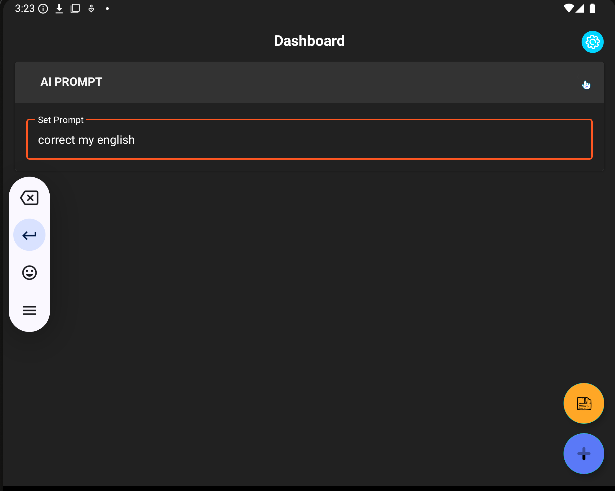
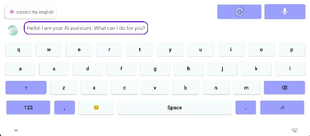
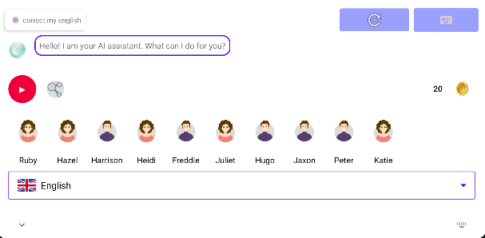
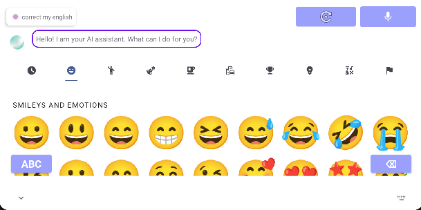

# AI Keyboard 🚀  

An advanced AI-powered keyboard featuring an integrated AI assistant, Text-to-Speech (TTS) functionality, and an enhanced typing experience. Built on [KeyboardGPT](https://github.com/bOsowski/KeyboardGPT) with **Llama AI** for intelligent text modification and **Murf API** for natural-sounding TTS.  

## ✨ Features  

### 🔥 AI-Powered Assistant  

  

- Modify and enhance typed text with AI.  
- Custom prompts like:  
  - ✅ **Correct my English**  
  - ✅ **Make my English sound American**  
  - ✅ **Rewrite in a professional tone**  
- Powered by **Llama AI** for smart suggestions.  

  

### 🎙️ Text-to-Speech (TTS) with AI Voices  
- Convert typed sentences into **high-quality AI-generated speech**.  
- Uses **Murf API** for realistic voice synthesis.  
- Download and share audio messages via **Messenger, Instagram, WhatsApp, and more**.  

  

### 😍 Emoji Support  
- Seamlessly integrated emoji picker for expressive typing.  

  

### ⚡ Smooth Typing Experience  
- Optimized touch response for faster and more accurate typing.  

## 📲 Installation  
1. Clone this repository:  
   ```bash
   git clone https://github.com/your-repo-name.git
   cd AI-Keyboard
   ```
2. Open the project in **Android Studio**.  
3. Build and install the APK on your device.  

## 🛠️ Built With  
- **[KeyboardGPT](https://github.com/bOsowski/KeyboardGPT)** – Base for AI integration.  
- **[Lama Ai](https://groq.com/)** – AI-powered text assistance.  
- **[Murf Api](https://murf.ai/api)** – AI-powered Text-to-Speech conversion.  

## 📃 Firebase Settings  

The project integrates Firebase services, including **Google Authentication**, **Remote Config**, and **Firestore Database**.

### 🔑 Google Authentication  
- Users can log in using their Google accounts.
- Secure authentication using Firebase Authentication.

### ⚙️ Remote Config  
- **Key**: `new_version_code`
- **Data Type**: `string`
- **Value**: `2`

### 🔮 Firestore Database  
The Firestore database stores user information in the `users` collection.

#### Collection: `users`
Each user is identified by a unique document ID.

Example User Documents:
```
users
  |➜ 3aGom8MaG8d52DUB7JFLKLPvsPD3
  |➜ R6oJzHYwYSg32QaTiRkSuR8IqkX2
  |➜ uLYFLdhAlRSlTgevA85tcCDccPN2
  |➜ yOmJLSGmehUyv3hcNbaK4XXKU252
```

Example User Document Structure:
```json
{
  "credits": 300,
  "email": "xyzabc@gmail.com"
}
```

### ⚖️ Firestore Security Rules  
```firestore-rules
rules_version = '2';

service cloud.firestore {
  match /databases/{database}/documents {
    match /users/{userId} {
      allow read: if request.auth != null && request.auth.uid == userId;

      // Allow update only if the new credit value is lower than the current value
      allow update: if request.auth != null && request.auth.uid == userId &&
        request.resource.data.credits < resource.data.credits;

      // Allow creating a user document only if it does not exist and credits <= 300
      allow create: if request.auth != null && request.auth.uid == userId &&
        !exists(/databases/$(database)/documents/users/$(userId)) &&
        request.resource.data.credits <= 300;
    }
  }
}
```

## 📜 License  
This project is open-source and available under the **MIT License**.  

## 🌎 Connect With Us  
For feedback, contributions, or suggestions, feel free to reach out or create an issue! 🚀  

---

Enjoy smarter, faster, and more expressive typing with **AI Keyboard 2.0**! 🎉  

